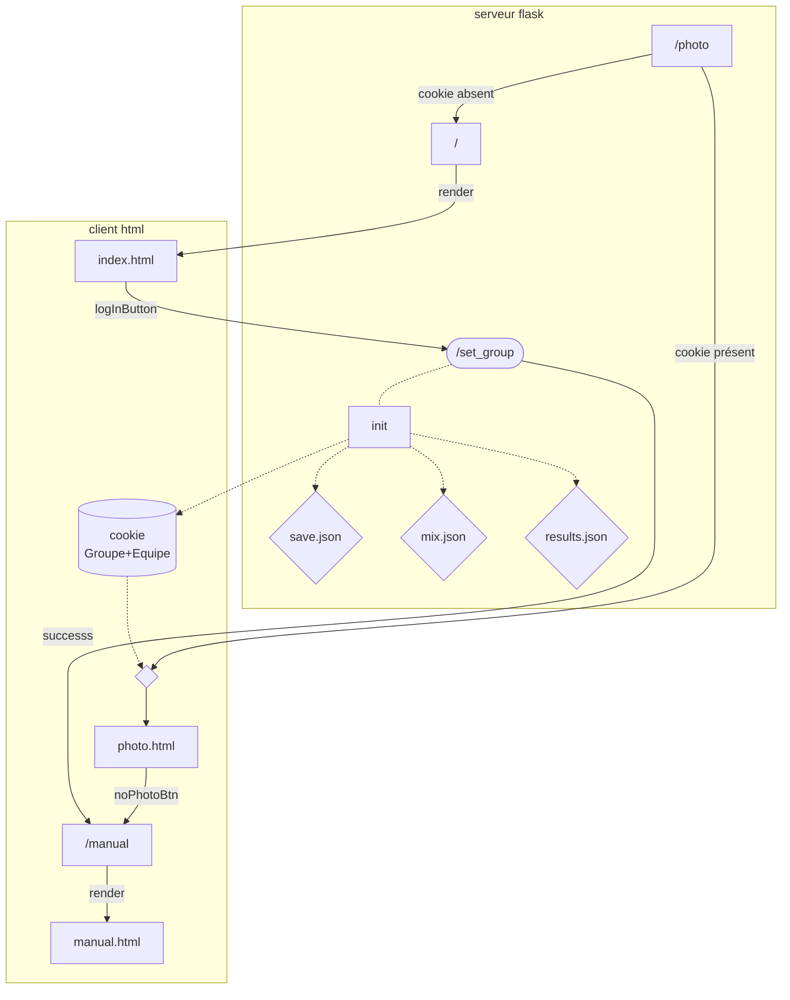

# CliMix

Pour générer la doc dans votre répertoire git allez voir les [instructions sur le Github](https://github.com/pascalacco/CliMix/blob/doc/doc/source/doc_howto.md)


## Machine à état des pages


## Installation

### Prérequis
python3.6 ou supérieur

### Installation des dépendances
```bash
pip install -r requirements.txt
```
### personnalisation des chemins
Dans le ficher flaskapp/constantes.py, modifier les chemins
 

