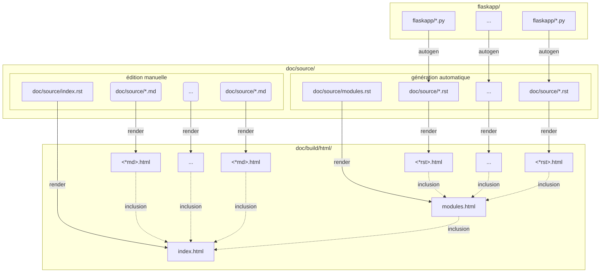

# Générer cette doc


On utilise *Sphynx* pour générer les pages html dans `doc/build/html` à partir du code python dans `flaskapp/` et de sources écrites manuellement en markdown dans `doc/source`

Pour cela il faut :

  1. Lancer la [commande make](#1---commande-make)
  2. Puis [visualiser la doc](#2---visualiser-la-doc)
  3. Pour modifier la doc voir le schéma de la [structure de la doc](#structure-de-la-doc-sphynx)

## 1 - Commande make

Dans un terminal se placer dans le répertoire du dépot git `CliMix` :
 1. Bien s'assurer que les paquets python sont installés
    * Si dans un environnement virtuel faire   
        ```bash 
        source venv/bin/activate
        ```   
        Sinon rien
    * Installer les requirements   
        ```bash 
        pip install -r requirements
        ```   
 2. Lancer la commande make
    ```bash
    cd doc  
    make html
    ```   

## 2 - Visualiser la doc
Naviguer et ouvrir le fichier `doc/build/html/index.html`   
ou bien sous linux   
```bash
firefox ./doc/build/html/index.html
```   


## Structure de la doc sphynx

Les fichier éditables sont les `.md` de `doc/source/` et le `doc/source/index.rst`   
Les commentaires du code `.py` du répertoire `flaskapp/` sont autogénérés 




